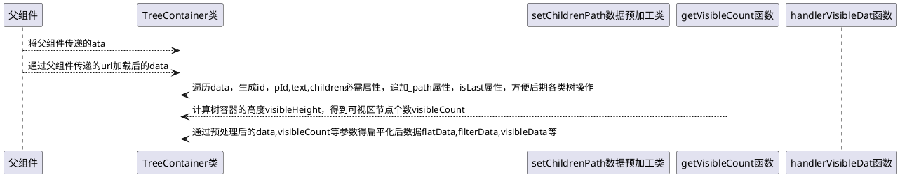
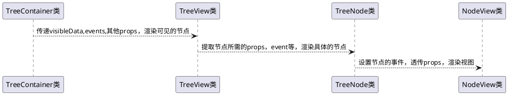

## <div style="text-align:center">树组件开发文档</div>

[toc]

### 1.开发目的

1. 实现对树组件的增删改查
2. 实现树组件的拖动，停靠
3. 实现树组件的父子勾选，单选
4. 实现树组件的节点图标，节点，虚线，皮肤的自定义
5. 10 万数据量高性能渲染
6. 子节点数据异步加载
7. 提供外部调用 api，获取树组件各类数据
8. 实现树组件事件的监听与取消
9. 实现容器高度变化自适应

### 2 树组件性能设计

#### 2.1 性能策略

##### 2.3.1 虚拟列表

1. 容器渲染完成后，拿到可见高度，通过节点行高，得到可见区域的节点个数
2. 要渲染的数据是`visibleData`：上部预留区域+可见区域-下部预留区域
3. 扁平化后切割数据，得到渲染数据:`visibleData`
4. 监听容器的滚动事件，得到起始下标，重新计算要渲染的数据,并且进行了节流

##### 2.3.2 除可见数据等少数状态外，整个树结构的数据不参与 State

1. 树的全部全部 data,扁平化数据 flatData,筛选后的数据等都不参与 State
2. 设置异步更新，将多次数据操作合并成一次更新`(父组件可能同时调用几个方法)`

##### 2.3.2 预处理数据，标准化节点数据结构：`id,pId,text,children`

通过字段属性名，标准化节点这四个字段值，方便对树节点的渲染与操作

##### 2.3.3 预处理数据，增加节点路径属性：`_path` 并且根据 id 作为 key 保存在 map 数据中`hashData`

1. 对传递的数据先进行预处理，设置节点\_path 属性，保存节点在树结构的路径
2. 能够通过\_path 快速找到节点，及祖先节点，快速操作树节点的勾选，增，删，修改，移动
3. 通过\_path 字段来确实节点前面空白占位宽度大小，扁平化后依然能显示层级关系
4. 通过`hashData`中的\_path，方便调用 Tree 组件父级通过 id 操作树节点的勾选，增，删，修改，移动

##### 2.3.4 预处理数据，增加`_isLast`

通过增加这个字段代表是否当前层级的最后一个节点，用来方便画虚线

##### 2.3.5 直接操作原 data，不使用扩展运算符等浅复制操作

浅复制是耗费性能的，在预处理与扁平化等算法中不进行浅复制，否则当数量过大，耗时极速增加

##### 2.3.6 提供 getisChecked,append，remove,update,moveIn,等多种方法方便父组件操作节点`避免重新渲染`

1. 父组件可以通过,findNode,findParents,getisChecked,getData 等多种方法来获取即时数据状态，
2. 父组件可以通过 selectNode, append，remove，update,moveIn 等来选中,追加，删除，更新，移动等节点等多种操作
3. `避免父组件更新data，从而导致整个组件重新渲染`

##### 2.3.7 缓存所有方法与组件，避免重复渲染，最大限度的优化组件

利用 useCallBack,useReduce,memo 等方式来减少重定义与渲染次数

#### 2.2 十万数据量的渲染情况

渲染情况不完全准确：

2.2.1 预处理数据平均时长：`约108ms`
2.2.2 扁平化数据平均时长：`约25ms`
2.2.3 首屏时间:`约0.8s`<sup style="color:#840909">需要继续优化</sup>
2.2.4 删除节点：`约73ms`
2.2.4 移动节点：`约126ms`

### 3. 树组件的设计思路

#### 3.1 树的关系图

```Mermaid
classDiagram
    class TreeContainer{
    树组件的容器，负责数据处理
    }
    class TreeView{
        树组件View渲染，
    }

    class TreeNode{
        树节点，处理节点事件
    }
    class NodeView{
        树节点视图，负责渲染
    }
    class CheckBox{
        复选框
    }
    class Radio{
        单选框
    }

    TreeContainer-->TreeView:树组件View
    TreeView-->TreeNode:树节点
    TreeNode-->NodeView:树节点View
    NodeView-->CheckBox:复选框
      NodeView-->Radio:单选框
    getVisibleCount-->TreeContainer:容器高度及可见节点数
    getData-->TreeContainer:url请求数据
    setChildrenPath-->TreeContainer:预处理数据
    showVisibleData-->TreeContainer:得到可见区域数据
    func-->setChildrenPath:【isSimpleData】转树结构
    func-->showVisibleData:扁平化数据

```

#### 3.2 树的数据流图示





#### 3.3 函数与类的作用

##### 3.3.1 getVisibleCount-获取可见区域节点数量

3. 根据容器高度得到可渲染的数据个数 visibleCount
4. 得到可见区域的起始结束下标(startIndex,endIndex),`不是了可见数据visibleData的起始下标，因为有上下预留区`

##### 3.3.2 showVisibleData-得到可见数据等

3. 将 data 扁平化得到 flatData
4. 得到`visibleData[可见数据]`,`filterData【过滤的数据】`,`flatData【扁平化数据】`,`data[原始可操作数据]`
5. 得到 `sliceBeginIndex[切割的起始下标]`,`sliceEndIndex[切割的结束下标]`
6. 在滚动过程不再扁平化，直接使用上次的 flatData
7. 除非有新的 filterValue,或者更新 Data 的结构,再重新扁平化

##### 3.3.3 getData-请求数据

如果传递的 url，进行 fetch 请求，得到传递的数据

##### 3.3.4 func-公共函数库

3. 提供公共函数，比如将简单数据转成树结构
4. diff 算法判断是否更新
5. 树结构数据扁平化

##### 3.3.6 setChildrenPath-预处理数据

3. 预处理数据，方便后期树节点的操作
4. 通过 idFeild,parentFeild,textFeild,childFeild 得到·`id，pId,text,children`属性
5. `id[key]`,`pId[父节点id]`,`text[文本】`,`children[子节点]`
6. 生成`_path`属性，即节点的路径，用于寻址
7. 生成`_isLast`属性，是否当前层级的最后一个节点，用于生成虚线

##### 3.3.6 treeFunc-树的操作

3. 树节点的寻址
4. 树节点的增删改查
5. 树节点选中，勾选
6. 树节点的筛选

##### 3.3.7 myReducer-树的 reduce 函数

处理树组件的 state

##### 3.3.8 TreeContainer-树的容器

3. 调用`【getVisibleCount】` `【showVisibleData】`进行第一次渲染
4. 处理树所有的事件，调用`[myReducer]`得到新的 state
5. 提供 ref 调用的方法，方便获树相关的数据
6. 将 state 传递给`[TreeView]`

##### 3.3.9 TreeView-树的视图

3. 处理节点是否为父节点
4. 将所需要属性与事件传递给树节点
5. 渲染树组件

##### 3.3.10 TreeNode-树节点容器

3. 处理树节点的所有事件，回传给树容器

##### 3.3.11 NodeView,CheckBox,Radio-树节点视图,复选框，单选框

NodeView：渲染树的节点
CheckBox：复选框
Radio：单选框

### 4. 树组件的使用说明

#### 2.1 下载方式

npm install wasabi-tree

#### 2.2 引入方式

```javascript
import Tree from "wasabi-tree";
import "wasabi-tree/lib/index.css";

function Demo(props) {
  return <Tree data={props.data}></Tree>;
}
```

#### 2.3 树属性

| 属性名         | 类型                               | 说明                                                                                                          | 默认值                      |
| -------------- | ---------------------------------- | ------------------------------------------------------------------------------------------------------------- | --------------------------- |
| name           | string                             | 树名称                                                                                                        | null                        |
| idField        | string                             | 指定哪个字段是节点的 id                                                                                       | id                          |
| parentField    | string                             | 指定哪个字段是节点的 pId                                                                                      | pId                         |
| textField      | string                             | 指定哪个字段是节点的 text                                                                                     | text                        |
| childrenField  | string                             | 指定哪个字段是节点的 children                                                                                 | children                    |
| url            | string                             | `1.后台查询地址，第一次自动查询 2.节点展开时如果asyncAble为true，而oAsync函数为空，则自动根据这个url地址查询` | null                        |
| params         | object                             | 向后台传输的额外参数                                                                                          | null                        |
| `dataSource`   | string                             | 有 url 参数时的返回的数据源中哪个属性作为数据源,可以分层比如`data.list `)                                     | data                        |
| headers        | array                              | 请求时传的表头参数                                                                                            | null                        |
| data           | array                              | 父组件传的固定数据                                                                                            | null                        |
| `isSimpleData` | bool                               | `是否使用简单的数据格式：只针对整个树的数据源,子节点异步查询不起作用。目的是在前端将扁平化数据转成树结构`     | false                       |
| dottedAble     | bool                               | 是否有虚线                                                                                                    | true                        |
| selectAble     | bool                               | 是否允许勾选                                                                                                  | false                       |
| checkStyle     | oneOf(["checkbox", "radio", func]) | 单选还是多选,可以通过函数返回自定义组件，`func(row){retrun node;}` 注意： `宽度20px,高度 30px`                | checkbox                    |
| checkType      | object                             | 勾选对于父子节点的关联关系`[y]代表选中，[n]代表取消 [p]父节点 [s]代表子节点`                                  | `{ "y": "ps", "n": "ps" }`  |
| radioType      | oneOf(["level", "all"])            | 单选时影响的层级`[level]同级 [all]整个树`                                                                     | `all`                       |
| renameAble     | bool                               | 是否允许重命名                                                                                                | false                       |
| removeAble     | bool                               | 是否允许移除                                                                                                  | false                       |
| draggAble      | bool                               | 是否允许拖动                                                                                                  | false                       |
| dropAble       | bool                               | 是否允许停靠                                                                                                  | false                       |
| dropType       | array                              | 停靠模式                                                                                                      | null,["before","in","after" |
| asyncAble      | bool                               | 展开节点是否可以异步加载数据                                                                                  | false                       |
| textFormatter  | func(row)                          | 自定义节点文本样式函数 例子：` (row)=>{return <div className="red">{row.text}</div>`                          | null                        |

#### 2.4 事件

| 属性名           | 类型 | 说明                                       | 参数                                                       | 返回值                               |
| ---------------- | ---- | ------------------------------------------ | ---------------------------------------------------------- | ------------------------------------ |
| onClick          | func | 单击的事件                                 | id,text,row                                                |
| onDoubleClick    | func | 双击事件                                   | id,text,row                                                |
| onCheck          | func | 勾选/取消勾选事件                          | isChecked, id, text, row                                   |
| onExpand         | func | 展开/折叠事件                              | open, id, text, row                                        |
| onRename         | func | 重命名事件                                 | id, text, row, newText                                     |
| onRemove         | func | 删除事件                                   | id, text, row                                              |
| onContextMenu    | func | 右键菜单                                   | id, text, row,event                                        |                           |
| onDrag           | func | 拖动事件                                   | id, text, row                                              |
| onDrop           | func | 停靠事件                                   | dragNode(移动节点), dropNode(停靠节点), dragType(停靠方式) |
| onAsync          | func | 节点异步查询，为 null，则会通过 url 来处理 | id, text, row                                              | data,即异步加载后节点数据            |
| beforeDrag       | func | 拖动前事件                                 | id, text, row                                              | `true(同意),false(不同意)`           |
| beforeDrop       | func | 停靠前事件                                 | dragNode(移动节点), dropNode(停靠节点), dragType(停靠方式  | `true(同意),false(不同意)`           |
| beforeRemove     | func | 删除前事件                                 | id, text, row                                              | `true(同意),false(不同意)`           |
| beforeRename     | func | 重命名前事件                               | id, text, row                                              | `true(同意),false(不同意)`           |
| beforeRightClick | func | 鼠标右键前事件                             | id, text, row                                              | `true(同意),false(不同意)  暂未开发` |

#### 2.5 组件方法（ref)

| 属性名       | 类型 | 说明                                               | 参数           | 返回值        |
| ------------ | ---- | -------------------------------------------------- | -------------- | ------------- |
| findNode     | func | 获取某个节点                                       | id             | node          |
| findParents  | func | 获取某个节点所有父节点包括自身                     | id             | [nodes]       |
| getData      | func | 获取所有节点                                       | null           | data          |
| getChecked   | func | 获取勾选节点                                       | null           | isCheckedData |
| setChecked   | func | 设置勾选节点                                       | id,isChecked   | null          |
| clearChecked | func | 清除全部勾选节点                                   | null           | null          |
| checkedAll   | func | 勾选全部节点                                       | null           | data          |
| selectNode   | func | 设置节点单击选中，并且滚动到此处，祖先节点全部展开 | id             | null          |
| remove       | func | 删除节点,可以传数组，代表删除多个                  | id 或者[id,id] | null          |
| removeAll    | func | 删除所有节点                                       | null           | null          |
| append       | func | 追加某个节点,id 为空时即为更新全部                 | children,id    | null          |
| update       | func | 更新某个节点,或者某组[node,node]                   | nodes          | null          |
| updateAll    | func | 更新整个树                                         | data           | null          |
| filter       | func | 过滤节点                                           | value          | null          |
| adjust       | func | 重新调整容器，适应容器高度发生变化                 | null           | null          |

#### 2.6 节点 Node 属性

| 属性名          | 类型   | 说明                                                        | 默认值                      |
| --------------- | ------ | ----------------------------------------------------------- | --------------------------- |
| isParent        | bool   | 是否是父节点                                                | null                        |
| id              | string | key 值,如果没有会根据树组件设定的 idField 来转换            | ""                          |
| pId             | string | 父节点 key 值 如果没有会根据树组件设定的 parentField 来转换 | ""                          |
| text            | string | 节点文本,如果没有会根据树组件设定的 textField 来转换        | ""                          |
| title           | string | 提示信息                                                    | ""                          |
| iconCls         | string | 默认图标                                                    | icon-text                   |
| iconClose       | string | [父节点]关闭图标                                            | icon-folder                 |
| iconOpen        | string | [父节点]展开图标                                            | icon-folder                 |
| arrowUnFoldIcon | node   | 节点展开的箭头图标组件                                      | icon-arrow-down             |
| arrowFoldIcon   | node   | 节点折叠的箭头图标组件                                      | icon-arrow-right            |
| isOpened        | bool   | 是否处于打开状态                                            | false                       |
| isChecked       | bool   | 是否被勾选                                                  | false                       |
| selectAble      | bool   | 是否允许勾选                                                | false                       |
| draggAble       | bool   | 是否允许拖动                                                | false                       |
| dropAble        | bool   | 是否允许停靠                                                | false                       |
| dropType        | array  | 停靠模式                                                    | null,["before","in","after" |
| href            | string | 节点的链接                                                  | null                        |
| hide            | bool   | 是否隐藏                                                    | false                       |
| children        | array  | 子节点,如果没有会根据树组件设定的 childrenField 来转换      | null                        |
