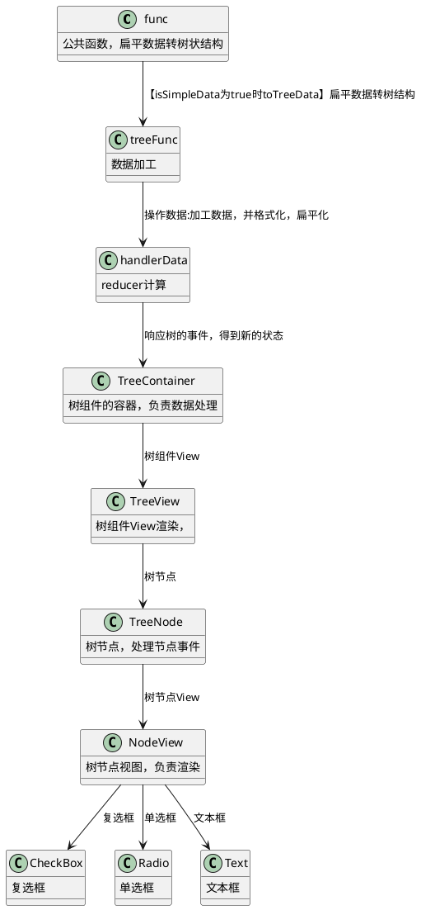
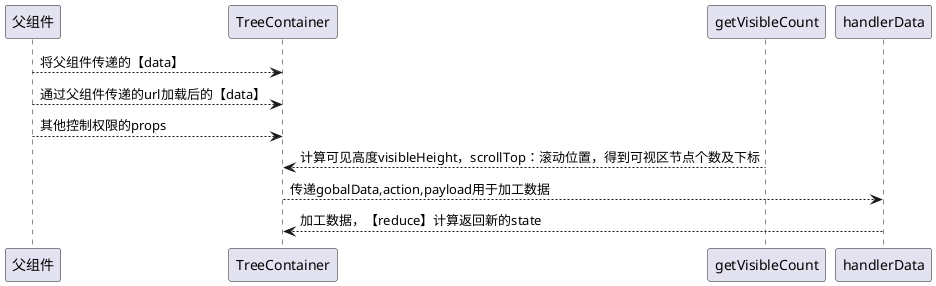
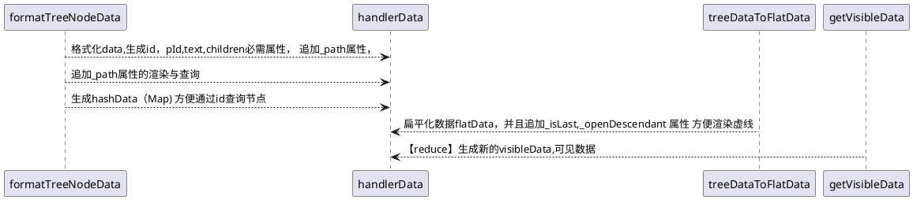
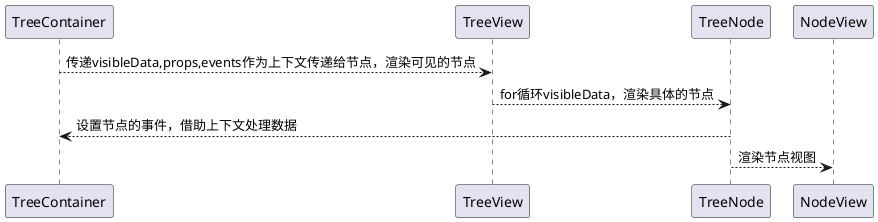

## <div style="text-align:center">树组件开发文档</div>

[toc]

### 1.开发目的

1. 实现对树组件的增删改查
2. 实现树组件的拖动，停靠
3. 实现树组件的父子勾选，单选，展开
4. 实现树组件的节点图标，节点，虚线，皮肤的自定义
5. 实现树组件通过 url 来加载数据
6. 子节点数据可以异步加载
7. 通过数据遍历算法优化及虚拟列表来实现大量数据时高性能渲染
8. 提供外部调用 api，获取树组件各类数据
9. 实现容器高度变化自适应

### 使用方式

#### 2.1 下载方式

npm install wasabi-tree
yarn add wasabi-tree

#### 2.2 引入方式

1 data 形式

```javascript
import Tree from "wasabi-tree";
import "wasabi-tree/lib/index.css";

function Demo(props) {
  return <Tree data={props.data}></Tree>;
}
```

2 url 形式

```javascript
import Tree from "wasabi-tree";
import "wasabi-tree/lib/index.css";

function Demo(props) {
  return <Tree url={props.url}></Tree>;
}
```

#### 2.3 树属性

| 属性名          | 类型                               | 说明                                                                                                          | 默认值                       |
| --------------- | ---------------------------------- | ------------------------------------------------------------------------------------------------------------- | ---------------------------- |
| name            | string                             | 树名称                                                                                                        | null                         |
| idField         | string                             | 指定哪个字段是节点的 id                                                                                       | id                           |
| parentField     | string                             | 指定哪个字段是节点的 pId                                                                                      | pId                          |
| textField       | string                             | 指定哪个字段是节点的 text                                                                                     | text                         |
| childrenField   | string                             | 指定哪个字段是节点的 children                                                                                 | children                     |
| url             | string                             | `1.后台查询地址，第一次自动查询 2.节点展开时如果asyncAble为true，而oAsync函数为空，则自动根据这个url地址查询` | null                         |
| params          | object                             | 向后台传输的额外参数                                                                                          | null                         |
| `dataSource`    | string                             | 有 url 参数时的返回的数据源中哪个属性作为数据源,可以分层比如`data.list `                                      | data                         |
| headers         | array                              | 请求时传的表头参数                                                                                            | null                         |
| data            | array                              | 父组件传的固定数据                                                                                            | null                         |
| `isSimpleData`  | bool                               | `是否使用简单的数据格式：。目的是在前端将扁平化数据转成树状结构`                                              | false                        |
| dottedAble      | bool                               | 是否有虚线                                                                                                    | true                         |
| selectAble      | bool                               | 是否允许勾选                                                                                                  | false                        |
| checkStyle      | oneOf(["checkbox", "radio", func]) | 单选还是多选,可以通过函数返回自定义组件，`func(row){retrun node;}` 注意： `宽度20px,高度 30px`                | checkbox                     |
| checkType       | object                             | 勾选对于父子节点的关联关系`[y]代表选中，[n]代表取消 [p]父节点 [s]代表子节点`                                  | `{ "y": "ps", "n": "ps" }`   |
| radioType       | oneOf(["level", "all"])            | 单选时影响的层级`[level]同级 [all]整个树`                                                                     | `all`                        |
| contextMenuAble | bool                               | 是否允许右键菜单名                                                                                            | null                         |
| renameAble      | bool                               | 是否允许重命名                                                                                                | null                         |
| renameIconAble  | bool                               | 是否允许有重命名图标                                                                                          | null                         |
| removeAble      | bool                               | 是否允许移除                                                                                                  | null                         |
| removeIconAble  | bool                               | 是否允许有删除图标                                                                                            | null                         |
| draggAble       | bool                               | 是否允许拖动                                                                                                  | null                         |
| dropAble        | bool                               | 是否允许停靠                                                                                                  | null                         |
| dropType        | array                              | 停靠模式                                                                                                      | null,["before","in","after"] |
| asyncAble       | bool                               | 展开节点是否可以异步加载数据                                                                                  | null                         |
| textFormatter   | func(row)                          | 自定义节点文本样式函数 例子：` (row)=>{return <div className="red">{row.text}</div>`                          | null                         |

#### 2.4 事件

| 属性名            | 类型 | 说明                                       | 参数                                                      | 返回值                     |
| ----------------- | ---- | ------------------------------------------ | --------------------------------------------------------- | -------------------------- |
| onClick           | func | 单击的事件                                 | id,text,row                                               | null                       |
| onDoubleClick     | func | 双击事件                                   | id,text,row                                               | null                       |
| onCheck           | func | 勾选/取消勾选事件                          | isChecked, id, text, row                                  | null                       |
| onExpand          | func | 展开/折叠事件                              | open, id, text, row                                       | null                       |
| onAdd             | func | 新增事件                                   | id, text, parentNode                                      | null                       |
| onRename          | func | 重命名事件                                 | id, text, row, newText                                    | null                       |
| onRemove          | func | 删除事件                                   | id, text, row                                             | null                       |
| onContextMenu     | func | 自定义右键菜单视图                         | id, text, row,event                                       | null                       |
| onDrag            | func | 拖动事件                                   | id, text, row                                             | null                       |
| onDrop            | func | 停靠事件                                   | dragNode(移动节点),dropNode(停靠节点)dragType(停靠方式)   | null                       |
| onAsync           | func | 节点异步查询，为 null，则会通过 url 来处理 | id, text, row                                             | 返回值即异步加载后节点数据 |
| onAsync           | func | 节点异步查询，为 null，则会通过 url 来处理 | id, text, row                                             | 返回值即异步加载后节点数据 |
| loadSuccess       | func | 有 url 时请求成功后的事件，用于加工数据    | data                                                      | 返回加工后的数据           |
| beforeContextMenu | func | 鼠标右键前事件                             | id, text, row ,event                                      | `true(同意),false(不同意)` |
| beforeAdd         | func | 新增前事件                                 | id, text, row                                             | `true(同意),false(不同意)` |
| beforeRemove      | func | 删除前事件                                 | id, text, row                                             | `true(同意),false(不同意)` |
| beforeRename      | func | 重命名前事件                               | id, text, row                                             | `true(同意),false(不同意)` |
| beforeDrag        | func | 拖动前事件                                 | id, text, row                                             | `true(同意),false(不同意)` |
| beforeDrop        | func | 停靠前事件                                 | dragNode(移动节点), dropNode(停靠节点), dragType(停靠方式 | `true(同意),false(不同意)` |

#### 2.5 组件方法（ref)

| 属性名       | 类型 | 说明                                               | 参数           | 返回值        |
| ------------ | ---- | -------------------------------------------------- | -------------- | ------------- |
| findNode     | func | 获取某个节点                                       | id             | node          |
| findParents  | func | 获取某个节点所有父节点包括自身                     | id             | [nodes]       |
| getData      | func | 获取所有节点                                       | null           | data          |
| getChecked   | func | 获取勾选节点                                       | null           | isCheckedData |
| setChecked   | func | 设置勾选节点                                       | id,isChecked   | null          |
| setDisabled  | func | 设置不可操作                                       | id,disabled    | null          |
| setLoading   | func | 设置加载状态                                       | id             | null          |
| clearLoading | func | 取消加载状态                                       |                | null          |
| clearChecked | func | 清除全部勾选节点                                   | null           | null          |
| checkedAll   | func | 勾选全部节点                                       | null           | data          |
| selectNode   | func | 设置节点单击选中，并且滚动到此处，祖先节点全部展开 | id             | null          |
| remove       | func | 删除节点,可以传数组，代表删除多个                  | id 或者[id,id] | null          |
| removeAll    | func | 删除所有节点                                       | null           | null          |
| append       | func | 追加某个节点,id 为空时即为更新全部                 | children,id    | null          |
| update       | func | 更新某个节点,或者某组[node,node]                   | nodes          | null          |
| updateAll    | func | 更新整个树                                         | data           | null          |
| filter       | func | 过滤节点,过滤的视图请自行设计                      | value          | null          |
| adjust       | func | 重新调整容器，适应容器高度发生变化                 | null           | null          |

#### 2.6 节点 Node 属性

| 属性名          | 类型         | 说明                                                        | 默认值           |
| --------------- | ------------ | ----------------------------------------------------------- | ---------------- |
| isParent        | bool         | 是否是父节点                                                | null             |
| id              | string       | key 值,如果没有会根据树组件设定的 idField 来转换            | ""               |
| pId             | string       | 父节点 key 值 如果没有会根据树组件设定的 parentField 来转换 | ""               |
| text            | string       | 节点文本,如果没有会根据树组件设定的 textField 来转换        | ""               |
| title           | string       | 提示信息                                                    | ""               |
| iconCls         | string /node | 默认图标,可以是组件                                         | icon-text        |
| iconClose       | string/node  | [父节点]关闭图标 可以是组件                                 | icon-folder      |
| iconOpen        | string/node  | [父节点]展开图标 可以是组件                                 | icon-folder      |
| arrowUnFoldIcon | node         | 节点展开的箭头图标组件                                      | icon-arrow-down  |
| arrowFoldIcon   | node         | 节点折叠的箭头图标组件                                      | icon-arrow-right |
| isOpened        | bool         | 是否处于打开状态                                            | null             |
| isChecked       | bool         | 是否被勾选                                                  | null             |
| contextMenuAble | bool         | 是否允许右键菜单                                            | null             |
| addAble         | bool         | 是否允许新增                                                | null             |
| removeAble      | bool         | 是否允许删除                                                | null             |
| removeIconAble  | bool         | 是否允许有删除图标                                          | null             |
| renameAble      | bool         | 是否允许重命名                                              | null             |
| renameIconAble  | bool         | 是否允许有重命名图标                                        | null             |
| selectAble      | bool         | 是否允许勾选                                                | null             |
| draggAble       | bool         | 是否允许拖动                                                | null             |
| dropAble        | bool         | 是否允许停靠                                                | null             |
| hide            | bool         | 是否隐藏                                                    | null             |
| disabled        | bool         | 是否不可操作                                                | null             |
| children        | array        | 子节点,如果没有会根据树组件设定的 childrenField 来转换      | null             |

### 3 树组件性能设计

#### 3.1 性能策略

##### 3.1.1 虚拟列表

1. 容器渲染完成后，拿到可见高度，通过节点行高，得到可见区域的节点个数
2. 要渲染的数据是`visibleData`：上部预留区域+可见区域-下部预留区域
3. 扁平化后切割数据，得到渲染数据:`visibleData`
4. 监听容器的滚动事件，得到起始下标，重新计算要渲染的数据,并且进行了节流

##### 3.1.2 树型结构与格式化，扁平化数据时优化算法

1. 在 toTreeData 函数中将后端二维表格数据转树型结构时，利用 hash,并且不破坏原始数据结构来优化算法。
2. formatTreeNodeData【格式化】与 treeDataToFlatData【扁平化】时：循环与递归过程中不使用浅复制，不创建新的对象，不删除， 只是单纯的 for

##### 3.1.3 格式化数据时，标准化节点数据结构：`id,pId,text,children`

通过字段属性名，标准化节点这四个字段值，方便对树节点的渲染与操作

##### 3.1.4 格式化数据，增加节点路径属性：`_path` 并且根据 id 作为 key 保存在 map 数据中`hashData`

1. 对传递的数据先进行预处理，设置节点\_path 属性，保存节点在树结构的路径
2. 能够通过\_path 快速找到节点，及祖先节点，快速操作树节点的勾选，增，删，修改，移动
3. 通过\_path 字段来确实节点前面空白占位宽度大小，扁平化后依然能显示层级关系
4. 通过`hashData`中的\_path，方便通过 id 快速找到节点 方便上层组件

##### 3.1.5 除可见数据等少数状态外，整个树结构的数据不参与 State

1. 树的全部全部 data,扁平化数据 flatData,筛选后的数据 filterData 等都不参与 State
2. 设置异步更新，将多次数据操作合并成一次更新`(父组件可能同时调用几个方法)`
3. state 只有四个属性：`visibleData,loadingId,clickId,scrollIndex`
4. `scrollIndex`为是 selectNode 方法，选中节点要滚动的位置，设置为对象，能够更好的监听变化，防止鼠标滚动后，再设置时值相同的问题

##### 3.1.6 提供通过`ref`来操作的多种方法方便父组件操作节点`避免更新整个data`

1. 父组件可以通过,findNode,findParents,getisChecked,getData 等多种方法来获取即时数据状态，
2. 父组件可以通过 setChecked,selectNode, append，remove，update,moveIn 等来勾选，选中,追加，删除，更新，移动等节点等多种操作
3. `这样避免父组件更新data，从而导致整体重新计算`

##### 3.1.7 缓存所有方法与组件，避免重复渲染，最大限度的优化组件

利用 useCallBack,useReduce,memo 等方式来减少重定义与渲染次数

##### 3.1.8 利用上下文传递透传树组件的属性与方法

利用 context 来缓存树组件本身的属性避属性在节点中一级一级传递

#### 3.1 十万数据量的渲染情况

渲染情况不完全准确：
2.2.1 isSimpleData 为 true 格式化数据平均时长：约`155ms`,
2.2.1 树状结格式化数据平均时长：约`33ms`
2.2.2 扁平化数据平均时长：约`25ms`
2.2.3 首屏时间:约`0.8s`
2.2.4 删除节点：约`73ms`
2.2.4 移动节点：约`126ms`

### 4 树组件的设计思路

#### 4.1 树的关系图



#### 4.2 树的数据流图示

##### 4.2.1 状态数据流



##### 4.2.1 data 加工流程



##### 4.2.1 data 组件数据流



#### 4.3 函数与类的作用

##### 4.3.1 getVisibleCount-获取可见区域节点数量

3. 根据容器高度得到可渲染的数据个数 visibleCount
4. 得到可见区域的起始结束下标(startIndex,endIndex),`不是了可见数据visibleData的起始下标，因为有上下预留区`

##### 4.3.2 getVisibleData-得到可见数据

3. 将 data 扁平化得到 flatData
4. 得到`visibleData[可见数据]`,`filterData【过滤的数据】`,`flatData【扁平化数据】`,`data[原始可操作数据]`
5. 得到 `sliceBeginIndex[切割的起始下标]`,`sliceEndIndex[切割的结束下标]`
6. 在滚动过程不再扁平化，直接使用上次的 flatData
7. 除非有新的 filterValue,或者更新 Data 的结构,再重新扁平化

##### 4.3.3 getData-请求数据

如果传递的 url，进行 fetch 请求，得到传递的数据

##### 4.3.4 func-toTreeData 转成树状结构

1. 将简单数据转成树结构

##### 4.3.5 treeFunc-树的操作

1. 树节点的寻址
2. 树节点的增删改查
3. 树节点选中，勾选
4. 树节点的移动，停靠
5. 树节点的筛选
6. 树节点的格式化
7. 树节点的扁平化

##### 4.3.6 treeFunc-formatTreeNodeData-格式化数据

1. 格式化数据，方便后期树节点的操作
2. 通过 idFeild,parentFeild,textFeild,childFeild 得到·`id，pId,text,children`属性
3. `id[key]`,`pId[父节点id]`,`text[文本】`,`children[子节点]`
4. 生成`_path`属性，即节点的路径，用于寻址及渲染
5. 生成`hashData`map，方便通过 id 来查询节点

##### 4.3.7 myReducer-树的 reduce 函数

处理树组件的 state

##### 4.3.8 TreeContainer-树的容器

1. 调用`【getVisibleCount】` `【showVisibleData】`进行第一次渲染
2. 处理树所有的事件，调用`[myReducer]`得到新的 state
3. 提供 ref 调用的方法，方便获树相关的数据
4. 利用上下文将 state，props 传递给`[TreeView]`

##### 4.3.9 TreeView-树的视图

1. 渲染树组件的节点

##### 4.3.10 TreeNode-树节点容器

1. 处理树节点的所有事件，回传给树容器

##### 4.3.11 NodeView,CheckBox,Radio.Text-树节点视图,复选框，单选框

NodeView：渲染树的节点视图
CheckBox：复选框
Radio：单选框
Text:编辑时的文本框
